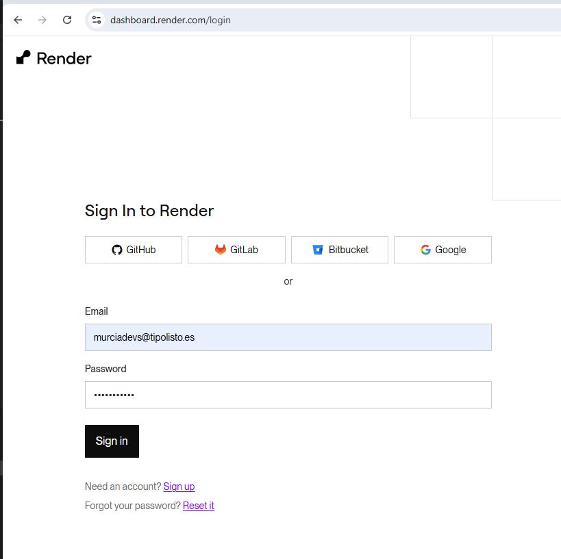

# Instrucciones

En el archivo "Como desplegar tu proyecto python a servidor gratuito.docx" se encuentran las instrucciones para subir el proyecto a render.com

# Prueba el proyecto aki: 

1. Ve a https://dashboard.render.com/login

2. logeate con la contraseña del cole
   

https://flask-web-wt8c.onrender.com

Proyecto: https://github.com/Murciadevs/flask-web

